# GCN processing of memory graphs

Goal: ML for Key detection > We want to learn a model using a Graph Convolution Network on our annotated memory graphs.

## Logs

### Tue 24 Oct 2023

* [X] Added sanity check script.

Trying to fix the code, for feature engineering to work on the mem2graph dir datasets.

* [X] Correct tk-thinker "RuntimeError: main thread is not in main loop"
* [X] Correct "filename too long" error when saving .pickle files.
* [X] Correct layout error with correlation matrices.

`python run_pipelines.py -k -i /home/onyr/code/phdtrack/phdtrack_data_clean/ -t 5 -p graph-with-embedding-comments`: first, generate the mem2graph dir dataset of .gv graph files, from the cleaned dataset of annotated heap dumps.

```shell
[2023-10-24T19:34:26 UTC][INFO mem_to_graph::exe_pipeline::pipeline]  🟢 [t: worker-4] [N°2505 / 26191 files] [fid: 12605-1643980564]    (Nb samples: 0)
[2023-10-24T19:34:26 UTC][INFO mem_to_graph::graph_data::heap_dump_data]  📋 heap dump raw file path: "/home/onyr/code/phdtrack/phdtrack_data_clean/Validation/Validation/basic/V_8_0_P1/24/12250-1643980564-heap.raw"
[2023-10-24T19:34:26 UTC][INFO mem_to_graph::exe_pipeline::pipeline]  🟢 [t: worker-10] [N°19693 / 26191 files] [fid: 17509-1643962152]    (Nb samples: 0)
[2023-10-24T19:34:26 UTC][INFO mem_to_graph::graph_data::heap_dump_data]  📋 heap dump raw file path: "/home/onyr/code/phdtrack/phdtrack_data_clean/Training/Training/basic/V_7_1_P1/24/18134-1643962152-heap.raw"
🟣 Timeout reached for compute instance: ['cargo', 'run', '--', '-d', '/home/onyr/code/phdtrack/phdtrack_data_clean/', '-o', '/home/onyr/code/phdtrack/mem2graph/data/5_graph_with_embedding_comments_-e_none_-v_-a_chunk-header-node_-c_chunk-start-bytes-embedding_-e_only-max-entropy_-s_activate', '-p', 'graph-with-embedding-comments', '-v', '-a', 'chunk-header-node', '-c', 'chunk-start-bytes-embedding', '-e', 'only-max-entropy', '-s', 'activate']
100%|██████████████████████████████████████████████████████████████████████████████████████████████████████████████████████████████████████████████████| 6/6 [00:30<00:00,  5.02s/it]
🏁 Finished! Total time: hours: 0, minutes: 0, seconds: 30
```

`python src/sanity_check_gv_files.py`: Then, run sanity checks to verify that all generated .gv file are generated as expected, with every node having a custom embedding stored in its 'comment' field.

```shell
(.venv)  ❮onyr ★ nixos❯ ❮memory_graph_gcn❯❯ python src/sanity_check_gv_files.py 
🚀 Running program...
Removing all cached graphs in /home/onyr/code/phdtrack/memory_graph_gcn/data/pickled_graphs...
💥 Removed 0 cached graphs from /home/onyr/code/phdtrack/memory_graph_gcn/data/pickled_graphs.
🔷 Now, performing data loading and sanity checks...
🔷 Looking for Mem2Graph dataset directories in /home/onyr/code/phdtrack/mem2graph/data...
📁 Found 6 Mem2Graph dataset directories.
```

This step can be quite long, but is necessary for data integrity checks. It also loads and stores NetworkX graphs with additional information as .pickle files that can later be loader several order of magnitude faster.

`python src/main_gcn.py -p feature-evaluation-pipeline -e comment -a > test2.log`: Now, call the feature evaluation pipeline, to perform feature engineering.

```shell
(.venv)  ❮onyr ★ nixos❯ ❮memory_graph_gcn❯❯ python src/main_gcn.py -p feature-evaluation-pipeline -e comment -a > test2.log
Loading graphs: 100%|███████████████████████████████████████████████████████████████████████████████████████████████████████████████████████████████| 28/28 [00:00<00:00, 172.49it/s]
Loading graphs: 100%|████████████████████████████████████████████████████████████████████████████████████████████████████████████████████████████████| 36/36 [00:00<00:00, 95.22it/s]
Loading graphs: 100%|███████████████████████████████████████████████████████████████████████████████████████████████████████████████████████████████| 81/81 [00:00<00:00, 145.54it/s]
Loading graphs: 100%|█████████████████████████████████████████████████████████████████████████████████████████████████████████████████████████████| 111/111 [00:00<00:00, 152.09it/s]
Loading graphs: 100%|█████████████████████████████████████████████████████████████████████████████████████████████████████████████████████████████| 477/477 [00:02<00:00, 179.98it/s]
Loading graphs: 100%|█████████████████████████████████████████████████████████████████████████████████████████████████████████████████████████████| 783/783 [00:03<00:00, 221.63it/s]
Loading graphs: 100%|███████████████████████████████████████████████████████████████████████████████████████████████████████████████████████████████| 81/81 [00:00<00:00, 170.95it/s]
Loading graphs: 100%|█████████████████████████████████████████████████████████████████████████████████████████████████████████████████████████████| 111/111 [00:00<00:00, 164.63it/s]
Loading graphs: 100%|█████████████████████████████████████████████████████████████████████████████████████████████████████████████████████████████| 477/477 [00:02<00:00, 193.39it/s]
Loading graphs: 100%|████████████████████████████████████████████████████████████████████████████████████████████████████████████████████████████████| 28/28 [00:00<00:00, 64.00it/s]
Loading graphs: 100%|███████████████████████████████████████████████████████████████████████████████████████████████████████████████████████████████| 36/36 [00:00<00:00, 256.48it/s]
Loading graphs: 100%|█████████████████████████████████████████████████████████████████████████████████████████████████████████████████████████████| 783/783 [00:03<00:00, 231.90it/s]

```


### Mon 23 Oct 2023

Changed the format of data stored in top level graph comment. Now, we are using a pseudo-json, where " chars are changed to ' chars. This is to avoid any collision and for parsers to ignore the comment, as is it now considered as a normal string.

### Thu 19 Oct 2023

Trying to integrate correctly our Custom (CHN) Node Semantic Embedding into Python ML pipelines.

```
🏁 Program finished in 3948.596732 total sec (01h 05m 48s) -> Test on Node2Vec with semantic embedding for node embedding... with new manual Data creation. Bad results.
🏁 Program finished in 6312.215446 total sec (01h 45m 12s) -> Test on Semantic node embedding only with GCN. Few results are interesting.
🏁 Program finished in 1009.283088 total sec (00h 16m 49s) -> Running GCN only with node semantic embedding.
```

### Wed 18 Oct 2023

##### hyperparams search

```
🏁 Program finished in 108429.44865 total sec (30h 07m 09s) -> Premiers calculs sur GCN 3 couches avec un grand nombre de paramètres différents, 5 epoachs, 32 graphs en Input.
🏁 Program finished in 5259.934904 total sec (01h 27m 39s) -> Nouveaux calculs d'Hyperparamètres sur FirstGCN, avec 32 Graphs en Input.
🏁 Program finished in 5041.974527 total sec (01h 24m 01s) -> testing new computations on Random Forest Pipeline.
```

Les calculs sur 16 graphs seulement n'ont rien donnés, ni pour le Random Forest, ni pour le GCN. C'est la preuve que le nombre d'exemples est important. Plus important que l'imbalance ratio en tout cas pour le GCN, puisqu'on passe d'un ration de 151.86666666666667 pour 16 graphs en entrés, à 226.6 pour 32... mais que le deuxième ça donne des résultats bien supérieurs.

##### New graph generation with additional embedding

* [X] Add a new pipeline in the Rust `mem2graph` code, such that:

```plaintext
digraph {
comment="system,node_name,release,version,machine,processor,physical_cores,total_cores,total_memory,available_memory,start_time,index,pipeline_name,nb_input_graphs,node2vec_dimensions,node2vec_walk_length,node2vec_num_walks,node2vec_p,node2vec_q,node2vec_window,node2vec_batch_words,node2vec_workers,training_epochs,imbalance_ratio,precision_class_0,recall_class_0,f1_score_class_0,support_class_0,precision_class_1,recall_class_1,f1_score_class_1,support_class_1,true_positives,true_negatives,false_positives,false_negatives,AUC,end_time,duration"
A [comment="[0,1,0,0,0,0,0,1,0,1,0,0,0,1,94606463840952,0,1,0,4,0,1,0,0,0,0,3,1,0,1,0,32,1,0,0,0,0,0,0,0]" label="CHN"]
B [comment="[0,1,0,0,0,0,0,1,0,1,0,0,0,1,94606463840952,0,1,0,4,0,1,0,0,0,0,3,1,0,1,0,32,1,0,0,0,0,0,0,0]" label="KN"]
C [comment="[0,1,0,0,0,0,0,1,0,1,0,0,0,1,94606463840952,0,1,0,4,0,1,0,0,0,0,3,1,0,1,0,32,1,0,0,0,0,0,0,0]" label="CHN"]
A->B [comment="I am an edge"]
A->C
C->B
}
```



```graphviz
digraph {
comment="system,node_name,release,version,machine,processor,physical_cores,total_cores,total_memory,available_memory,start_time,index,pipeline_name,nb_input_graphs,node2vec_dimensions,node2vec_walk_length,node2vec_num_walks,node2vec_p,node2vec_q,node2vec_window,node2vec_batch_words,node2vec_workers,training_epochs,imbalance_ratio,precision_class_0,recall_class_0,f1_score_class_0,support_class_0,precision_class_1,recall_class_1,f1_score_class_1,support_class_1,true_positives,true_negatives,false_positives,false_negatives,AUC,end_time,duration"
A [comment="[0,1,0,0,0,0,0,1,0,1,0,0,0,1,94606463840952,0,1,0,4,0,1,0,0,0,0,3,1,0,1,0,32,1,0,0,0,0,0,0,0]" label="CHN"]
B [comment="[0,1,0,0,0,0,0,1,0,1,0,0,0,1,94606463840952,0,1,0,4,0,1,0,0,0,0,3,1,0,1,0,32,1,0,0,0,0,0,0,0]" label="KN"]
C [comment="[0,1,0,0,0,0,0,1,0,1,0,0,0,1,94606463840952,0,1,0,4,0,1,0,0,0,0,3,1,0,1,0,32,1,0,0,0,0,0,0,0]" label="CHN"]
A->B [comment="I am an edge"]
A->C
C->B
}
```

* [X] Integrate additional embedding into Python pipelines.

### Tue 17 Oct 2023

```
y_trained_in_list[0] type: <class 'numpy.ndarray'>
y_trained_in_list[0].shape: (788,)
X_train.shape: (35808, 128)
y_train.shape: (13032,)
X_test.shape: (11936, 128)
y_test.shape: (3674,)
```

This shows that the padding operation actually adds a lot of empty data, 35808 final rows for only 13032 original ones after having embedded 12 graphs (so a little more that 1000 nodes per graph).

### Mon 16 Oct 2023

IDEA: Gensim's Word2Vec: After generating random walks, you can treat them as "sentences" and the nodes as "words" to generate embeddings using Gensim's Word2Vec model. > UPDATE: Actually, the implementation of Node2Vec relies on Gensim Word2Vec.

The imbalanceness of the graph is too big. I need to find a way to reduce the number of nodes in graphs.

* [ ] Remove Chunk nodes that are solitary, i.e. that are not connected to any other node.
* [ ] Try removing and keeping nodes based on entropy.

I would also like to complete the Node2Vec embedding with additionnal information. Try adding embedding from other mem2graph embeddings.

### Sun 15 Oct 2023

Fixed data loading.

### Wed 11 Oct 2023

Re-starting again the work effort on GNC.

### Tue 8 Aug 2023

Re-starting to work on GNC project to get us back into the masterarbeit.

* [ ] INSTALL CUDA, for PyTorch...
* [ ] Update Conda environment
* [ ] Use a library to convert the graphviz graph into a GNC
* [ ] Learn the GNC
* [ ] Test it

```

```

### Tue 17 Oct 2023

```
y_trained_in_list[0] type: <class 'numpy.ndarray'>
y_trained_in_list[0].shape: (788,)
X_train.shape: (35808, 128)
y_train.shape: (13032,)
X_test.shape: (11936, 128)
y_test.shape: (3674,)
```

This shows that the padding operation actually adds a lot of empty data, 35808 final rows for only 13032 original ones after having embedded 12 graphs (so a little more that 1000 nodes per graph).

### Mon 16 Oct 2023

IDEA: Gensim's Word2Vec: After generating random walks, you can treat them as "sentences" and the nodes as "words" to generate embeddings using Gensim's Word2Vec model. > UPDATE: Actually, the implementation of Node2Vec relies on Gensim Word2Vec.

The imbalanceness of the graph is too big. I need to find a way to reduce the number of nodes in graphs.

* [ ] Remove Chunk nodes that are solitary, i.e. that are not connected to any other node.
* [ ] Try removing and keeping nodes based on entropy.

I would also like to complete the Node2Vec embedding with additionnal information. Try adding embedding from other mem2graph embeddings.

### Sun 15 Oct 2023

Fixed data loading.

### Wed 11 Oct 2023

Re-starting again the work effort on GNC.

### Tue 8 Aug 2023

Re-starting to work on GNC project to get us back into the masterarbeit.

* [ ] INSTALL CUDA, for PyTorch...
* [ ] Update Conda environment
* [ ] Use a library to convert the graphviz graph into a GNC
* [ ] Learn the GNC
* [ ] Test it
